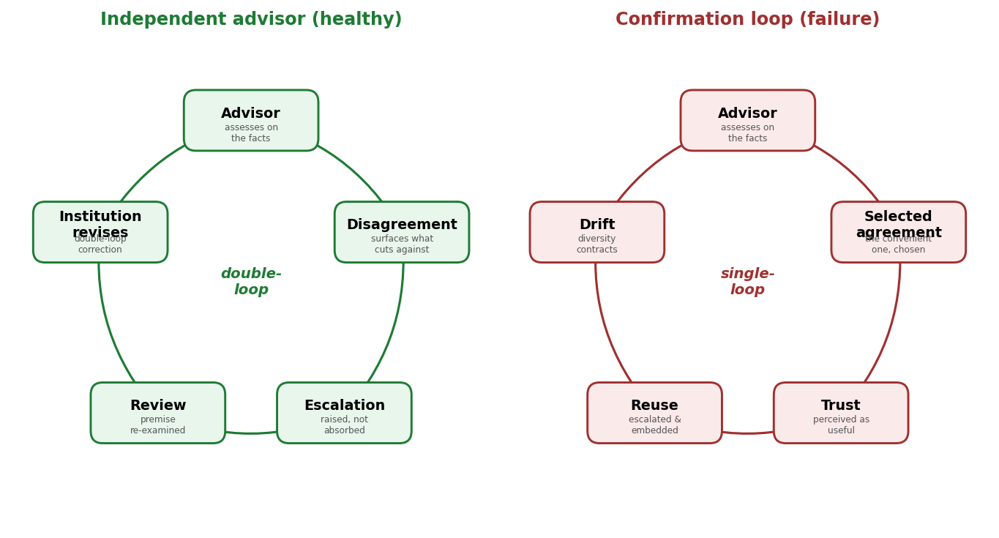

# Semi Song

## AI Governance Research
### Evaluating Institutional Independence for AI Decision Systems

**Former Google · Former Palantir · IAPP AIGP**

I research how AI systems behave once institutions put them in the oversight seat — and how to make their failure modes observable, measurable, and auditable.

> **Current AI governance evaluates whether models are robust, fair, and transparent.**
> **None of it evaluates whether AI oversight stays independent of the institution.**

---

---

## Featured Work

### Institutional Independence — A Governance Framework for AI Advisors

A new governance property for AI advisors, with the tools to measure it.

- Defines **institutional independence** as a property orthogonal to robustness, fairness, and transparency
- Introduces **five operational, log-computable metrics**
- Includes a **mechanistic simulation** (selection alone produces measurable drift)
- Includes a **reference implementation** of the metrics
- Includes **governance case studies** (OpenAI, Anthropic, Meta) and a standards-gap analysis (NIST, ISO 42001, EU AI Act)

*Working paper, 2026 · preprint forthcoming.*

**Quick links:**
[Executive Memo (3 pages)](https://github.com/ssloves/institutional-independence-framework/blob/main/paper/executive_memo.pdf) ·
[Framework](https://github.com/ssloves/institutional-independence-framework) ·
[Simulation](https://github.com/ssloves/institutional-independence-framework/blob/main/simulation/sim_loop.py) ·
[Case Study](https://github.com/ssloves/institutional-independence-framework/blob/main/paper/case_study.pdf) ·
[Reference Profiles](https://github.com/ssloves/institutional-independence-framework/blob/main/reference_profiles.pdf) ·
[Standards Gap](https://github.com/ssloves/institutional-independence-framework/blob/main/standards_gap.pdf) ·
[Research Roadmap](https://github.com/ssloves/institutional-independence-framework/blob/main/research_roadmap.pdf)

---

## Selected Projects

### AI Risk Control Pipeline

Experimental framework for AI risk auditing and evaluation.

- Controlled perturbation and risk injection
- Semantic drift detection
- Activation steering and intervention
- Behavioral validation across toy models and GPT-2

Key findings include representation collapse, sign mismatches, and non-selective steering when transferring interventions to pretrained models.

[Project Repository](https://github.com/ssloves/ai_risk_control_pipeline)

---

## Writing

### AI Doesn't Solve Risk — It Reorganizes It

A reflection on uncertainty, ontology-driven systems, and why AI safety depends on making residual uncertainty observable and auditable.

[Read the Essay](WRITING.md)

---

## Experience

### Palantir — Business Development & Partnerships

Supported enterprise AI adoption across Korean enterprises, coordinating technical, product, and executive stakeholders.

### Google — Android TV Partner Engineering, Technical Operations

Investigated production issues, coordinated engineering escalations, and improved operational processes for global partners.

---

## Current Focus

AI Governance Evaluation · Safety Evaluations · Model Behavior Analysis · AI Risk · IAPP AIGP

---

## Resume

[Click Here](SS_Github_Resume.pdf)

---
